## Skrub {.smaller}

Machine learning on tabular data


::: {style="display: flex; align-items: center; gap: 1.5rem; margin-top: 1.5rem;"}
{height="40px"}
 
{height="40px"}
 
{height="40px"}
:::

:::: {.columns}

::: {.column width="49%"}
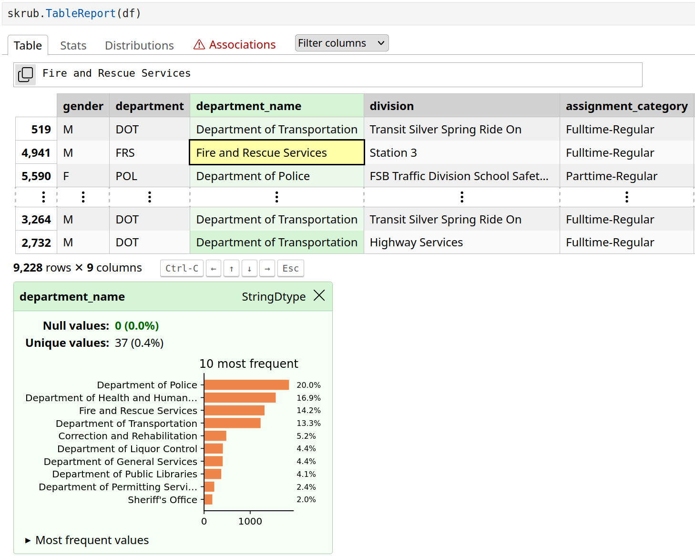
:::

::: {.column width="49%"}
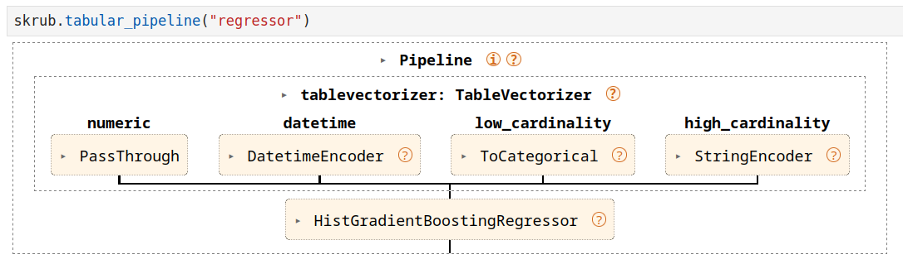

::: {.incremental}
- [skrub-data.org](https://skrub-data.org)
- This talk: the [skrub DataOps](https://skrub-data.org/stable/data_ops.html) framework.
:::

:::

::::

## {.smaller}

:::: {.columns}

::: {.column width="44%"}

**Textbook ML**

<br>

$X \in \mathbb{R}^{n \times p},\ y \in \mathbb{R}^n$

$\hat{y} = f_{\hat{\theta}}(X)$

<br>

```{=html}
<pre><code class="language-python">estimator = <span style="outline: 3px transparent; outline-offset: 1px;">TabICLRegressor()</span>

cross_validate(estimator, X, y)

estimator.fit(X_train, y_train)
estimator.predict(X_new)</code></pre>
```
:::

::: {.column width="55%"}
**Data-Science Practice**

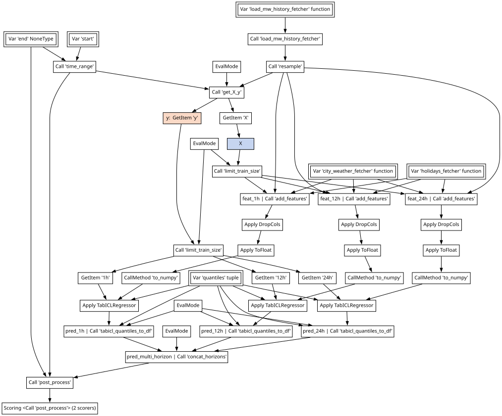
:::

::::

## {.smaller}

:::: {.columns}

::: {.column width="44%"}

**Textbook ML**

<br>

$X \in \mathbb{R}^{n \times p},\ y \in \mathbb{R}^n$

$\hat{y} = f_{\hat{\theta}}(X)$

<br>

```{=html}
<pre><code class="language-python">estimator = TabICLRegressor()

cross_validate(estimator, <span style="outline: 3px solid #2a52a8; outline-offset: 1px;">X</span>, <span style="outline: 3px solid #c04a10; outline-offset: 1px;">y</span>)

estimator.fit(X_train, y_train)
estimator.predict(X_new)</code></pre>
```
:::

::: {.column width="55%"}
**Data-Science Practice**

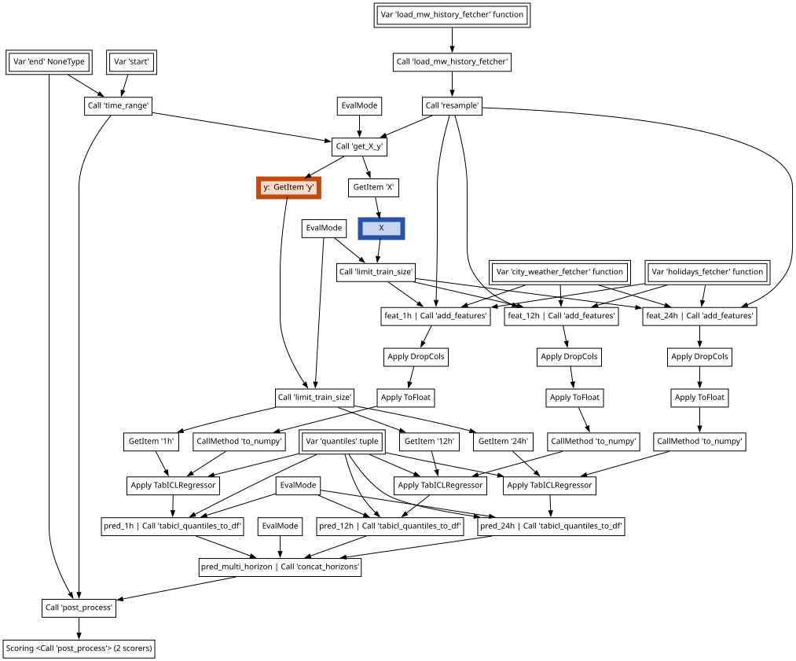
:::

::::

## {.smaller}

:::: {.columns}

::: {.column width="44%"}

**Textbook ML**

<br>

$X \in \mathbb{R}^{n \times p},\ y \in \mathbb{R}^n$

$\hat{y} = f_{\hat{\theta}}(X)$

<br>

```{=html}
<pre><code class="language-python">estimator = <span style="outline: 3px solid blue; outline-offset: 1px;">TabICLRegressor()</span>

cross_validate(estimator, X, y)

estimator.fit(X_train, y_train)
estimator.predict(X_new)</code></pre>
```
:::

::: {.column width="55%"}
**Data-Science Practice**

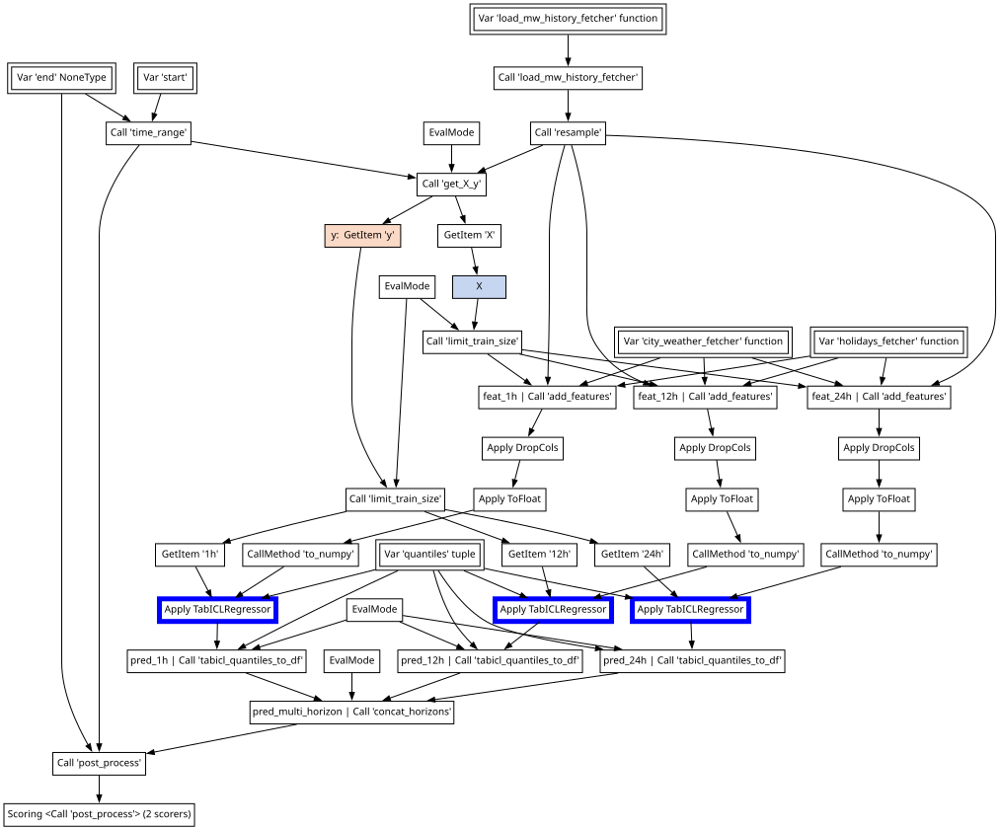
:::

::::

##

**Data wrangling:** filtering, resampling, aggregations, joins, ...

- Cross-validate without [**data leaks**]{style="color: #1a5a8a; font-weight: bold;"}.

:::: {.columns}

::: {.column width="50%"}
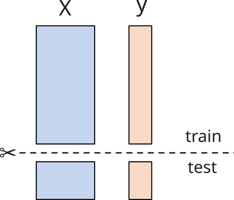
:::

::: {.column width="50%"}

:::

::::

##

**Data wrangling:** filtering, resampling, aggregations, joins, ...

- [**Tune choices**]{style="color: #1a5a8a; font-weight: bold;"} with validation scores.

::: {style="font-size: 0.75em; color: #666; margin-left: 1em; margin-top: -1em;"}
- Hyperparameters
- Which encoding for categories, text, dates, ...
- How to aggregate, what external information to join
- Which lags, rolling windows
:::

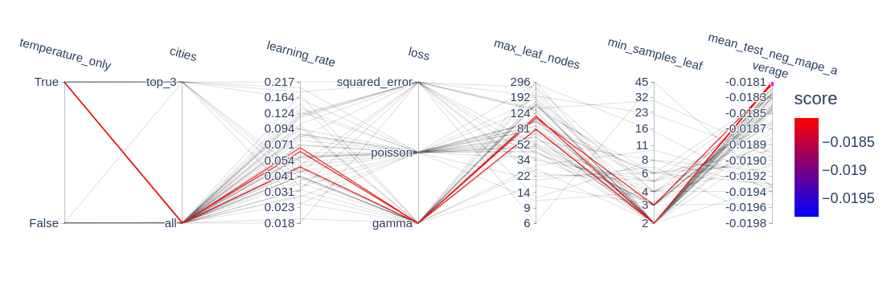

##

**Data wrangling:** filtering, resampling, aggregations, joins, ...

- [**fit**]{style="color: #1a5a8a; font-weight: bold;"} to training data and store important [**state**]{style="color: #1a5a8a; font-weight: bold;"}.
- Replay on [**new inputs**]{style="color: #1a5a8a; font-weight: bold;"}.

<br/>

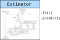

<!--

##

**Data wrangling:** filtering, resampling, aggregations, joins, ...

- Cross-validate without [**data leaks**]{style="color: #1a5a8a; font-weight: bold;"}.
- [**Tune choices**]{style="color: #1a5a8a; font-weight: bold;"} with validation scores.
- Replay on [**new inputs**]{style="color: #1a5a8a; font-weight: bold;"}.

::: {.callout-note icon=false style="font-size: 1em;"}
### DataOps

- All the goodies of the scikit-learn framework: `fit()` & `predict()`, cross-validation, hyperparameter tuning, serialization.
- Without the usual restrictions & while supporting **arbitrary data processing**.
  [Multiple inputs, feature & target construction, filtering samples, dynamic arguments for CV splitters & scorers, etc.]{style="font-size: 0.8em; color: gray;"}
- And more: Optuna integration, dynamic previews, pipeline inspection, ...
:::

-->

## How to use DataOps

## Basic example {.smaller}

Declare the pipeline

```python
data_path = skrub.var("data_path")
data = data_path.skb.apply_func(pd.read_csv)
X = data.drop(columns="target", errors="ignore").skb.mark_as_X()
y = data["target"].skb.mark_as_y()
pred = X.skb.apply(StandardScaler()).skb.apply(LogisticRegression(), y=y)
```

Cross-validate

```python
pred.skb.cross_validate({"data_path": "historical_data.csv"})
```

Make a "learner" (object with `fit()` & `predict()`)

```python
learner = pred.skb.make_learner().fit({"data_path": "historical_data.csv"})
learner.predict({"data_path": "new_data.csv"})
```

<a href="http://localhost:8888/notebooks/intro/intro.ipynb" target="_blank">intro.ipynb</a>

##

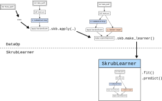

## ``.skb.apply()`` {.smaller}

Rolling your own ``ColumnTransformer`` or ``TableVectorizer``:

```python
from skrub import selectors as s

X = skrub.var("X")

numeric = X.skb.select(s.numeric()).skb.apply(skrub.SquashingScaler())
string = X.skb.select(s.string()).skb.apply(skrub.StringEncoder())
datetime = X.skb.select(s.any_date()).skb.apply(skrub.DatetimeEncoder())

vectorized = numeric.skb.concat([string, datetime], axis=1)
```

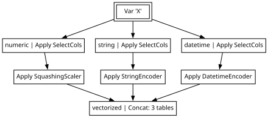


## Tuning choices: scikit-learn {.smaller}

```python
pipeline = Pipeline(
    [
        ("scaler", StandardScaler()),
        ("classifier", LogisticRegression()),
    ]
)
param_distributions = [
    {
        "scaler": [StandardScaler()],
        "classifier": [LogisticRegression()],
        "classifier__C": stats.loguniform(0.01, 10.0),
    },
    {
        "scaler": [SquashingScaler()],
        "scaler__quantile_range": [(25.0, 75.0), (10.0, 90.0)],
        "classifier": [LogisticRegression()],
        "classifier__C": stats.loguniform(0.01, 10.0),
    },
    {
        "scaler": [StandardScaler()],
        "classifier": [RidgeClassifier()],
        "classifier__alpha": stats.loguniform(0.02, 20.0),
    },
    {
        "scaler": [SquashingScaler()],
        "scaler__quantile_range": [(25.0, 75.0), (10.0, 90.0)],
        "classifier": [RidgeClassifier()],
        "classifier__alpha": stats.loguniform(0.02, 20.0),
    },
]
search = RandomizedSearchCV(pipeline, param_distributions).fit(X, y)
```

- Ranges declared outside of the pipeline
- Can only tune estimator parameters, not other choices

## Tuning choices: skrub

```{=html}
<ul style="font-size: 0.8em;">
<li>Replace any value with a choice:</li>
</ul>
<pre style="font-size: 0.55em; background-color: #f5f5f5; padding: 0.6em 1em; margin: 0.8em 0;"><code style="background-color: inherit;"> X = data.drop(columns="target", errors="ignore").skb.mark_as_X()
 y = data["target"].skb.mark_as_y()
 pred = X.skb.apply(StandardScaler()).skb.apply(
<span style="color: #c00; background-color: #fff0f0;">-    LogisticRegression(<span style="background-color: #f9a0a0;">C=1.0</span>),</span>
<span style="color: #080; background-color: #f0fff0;">+    LogisticRegression(<span style="background-color: #9be99b;">C=skrub.choose_float(0.1, 10.0, log=True)</span>),</span>
     y=y)</code></pre>
<ul style="font-size: 0.8em;">
<li>Use grid search or randomized search (possibly backed by Optuna).</li>
</ul>
<pre style="font-size: 0.55em; background-color: #f5f5f5; padding: 0.6em 1em; margin: 0.8em 0;"><code style="background-color: inherit;"><span style="color: #c00; background-color: #fff0f0;">-learner = pred.skb.<span style="background-color: #f9a0a0;">make_learner</span>().fit({...})</span>
<span style="color: #080; background-color: #f0fff0;">+learner = pred.skb.<span style="background-color: #9be99b;">make_randomized_search</span>().fit({...})</span></code></pre>
```

<a href="http://localhost:8888/notebooks/intro/tuning.ipynb" target="_blank">tuning.ipynb</a>

##

**Example: electricity load forecasting**

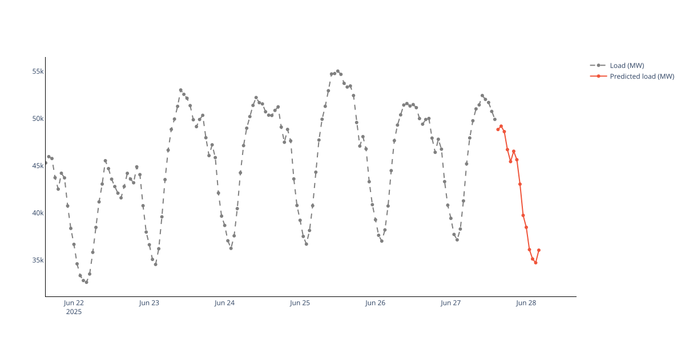

<a href="http://localhost:8888/notebooks/electricity/electricity_forecasting_example.ipynb" target="_blank">electricity_forecasting_example.ipynb</a>

## skrub DataOps

`fit() & predict()`, cross-validation, tuning for complex predictive pipelines.

<br>

- [this presentation & notebooks](https://github.com/jeromedockes/euroscipy-2026-presentation)
- [docs](https://skrub-data.org/stable/data_ops.html) on skrub-data.org
- skrub [discord server](https://discord.gg/ABaPnm7fDC)
- `jerome@dockes.org`

##

##

:::: {.columns}

::: {.column width="15%"}
[**orders**]{style="font-size: 0.5em; line-height: 1; padding-left: 3rem;"}
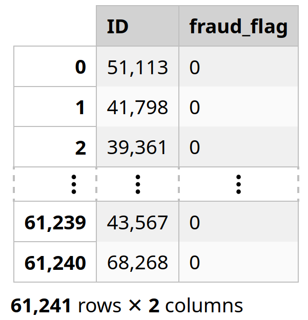{width="100%" style="margin-top: -0.5rem;"}
:::

::: {.column width="70%"}
[**items**]{style="font-size: 0.5em; line-height: 1; padding-left: 3rem;"}
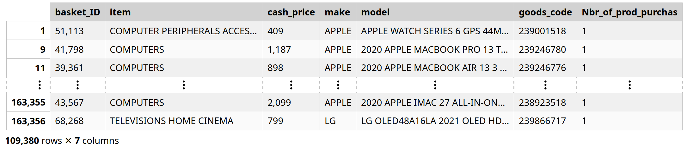{width="100%" style="margin-top: -0.5rem;"}
:::

::::
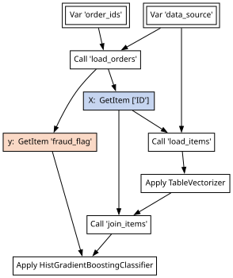{style="height: 20vh; margin-top: -2rem;"}